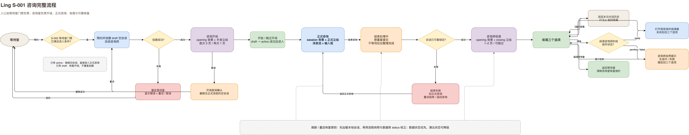

# S-001 咨询完整流程设计

状态：体验方案、实现与自动化验证已完成
日期：2026-07-12  
执行分支：`feat/consultation-complete-loop`  
执行工具：Codex

## 1. 目标

把 Ling 当前“预约后直接进入消息输入页”的路径，改造成一条完整、安静、可恢复的咨询循环：

```text
等待室预约
→ 咨询室开场
→ 正式咨询
→ 结束处理
→ 咨询师收尾
→ 浏览对话 / 阅读来信 / 返回等待室
```

体验必须同时满足：

1. 进入咨询有郑重感，但不拖慢真正开始咨询；
2. 结束咨询有余温，但不挽留用户、不制造依赖；
3. 刷新、重启、失败和重复点击不会让会谈状态与画面状态分离；
4. 不改变模型 Prompt 正文、上下文选择与预算、咨询记忆、概念化、督导和来信生成内容；
5. 接通 S-002 等待室知情说明 Demo，并为未来等待室沙发读信入口和其他空间功能留下稳定接头。

完整状态图：



## 2. 已确认的产品决定

### 2.1 知情说明的位置

知情说明只在等待室完成，由 S-002 独立模块负责。S-001 的咨询室开场中不展示、不重复确认知情说明。

稳定接头是：等待室只有在 S-002 判断用户已经确认当前版本后，才调用 S-001 的“创建并进入咨询”命令。S-002 使用独立的版本化本地记录；S-001 流程状态机不解析说明内容，也不在咨询室提供临时占位弹窗。

### 2.2 首次、再次与继续旧会谈

- 第一次与某位咨询师开始正式会谈：播放该咨询师的三页首次开场；
- 再次与同一位咨询师创建新会谈：播放一页简短问候；
- 继续尚未结束的旧会谈：直接进入正式咨询，不重播开场；
- 打开已经结束的旧会谈：直接进入只读历史，不重播收尾；
- 三位咨询师分别判断，见过程灵不影响第一次见周舟或林乐水；
- 在开场阶段取消并被删除的空会谈不计作“见过”。

### 2.3 收尾后的三个选择

收尾对白结束后固定显示：

1. `浏览对话历史`
2. `阅读咨询师的信`
3. `返回等待室`

不自动返回等待室，也不提供含义模糊的“留在这里”。

### 2.4 历史会谈

- 咨询室只显示当前咨询师的会谈，不混入其他咨询师；
- 当前会谈与历史会谈分开；
- 历史会谈默认折叠，用户点击后才展开；
- 展开后按最近更新时间倒序；
- 保留打开、重命名、删除和搜索；
- 切换咨询师或重新进入咨询室后，历史栏目恢复折叠；
- 从收尾选择“浏览对话历史”时，只浏览本次会谈，不展示整个侧栏，避免误切到其他会谈而丢失收尾出口。

## 3. 完整用户流程

### 3.1 从等待室预约

1. 用户在等待室选择咨询师并点击“预约咨询”。
2. S-002 的等待室门禁完成判断；已满足条件时才继续。
3. 如果这位咨询师已有未完成会谈，只提供`继续上次咨询`，不允许并行创建第二条。这个门禁同时存在于 renderer 、main 的按咨询师串行队列和 SQLite 原子事务，避免多入口或双击绕过。
4. 已有 `draft` 时恢复咨询室开场，已有 `active` 时直接恢复正式咨询；空 draft 仍可在开场取消。
5. 新建按钮进入提交中状态，使用 operation ID 和全局创建锁防止双击、快捷键或多个入口重复创建。
6. renderer 创建状态为 `draft`、消息为空的新会谈，并在数据库中冻结所选咨询师。
7. 创建成功后记录开场阶段，再切换到咨询室。
8. 创建失败时留在等待室，显示服务端返回的可读错误，并提供`重新尝试`与`取消`。

进入顺序必须是“创建成功 → 保存流程快照 → 切换页面”，不能先进入空咨询室再等待创建。

“继续旧会谈”与“开始新会谈”是两条不同命令，不能再沿用 `bookedCounselorId` 或“当前咨询师碰巧相同就复用”的隐式规则。大厅介绍页、设置页预约入口、任心预约入口都只发出意图，由同一个流程协调器执行。

设置页等等待室外部入口先携带所选咨询师回到等待室并打开预约面板，再由等待室门禁调用流程协调器；不能从设置页直接创建会谈或进入咨询室。这样 S-002 永远有一个稳定、可见的等待室承载面。

### 3.2 咨询开场

每次新预约创建成功后，先进入咨询室到达场记：只显示该咨询师的 `opening` 完整背景，不显示人物、对白框或其他操作按钮；在后续对白框对应的下方区域显示贯穿视口的暖色半透明横条，按真实本地日期缓慢逐字显示“某年某月某日，群心心理工作室，某某的咨询室”。逐字阶段第一次点击只补全整句；整句出现后再次点击立即进入原有开场，若用户不操作则等待 3 秒自动进入。继续 `active` 会谈、打开已结束历史或恢复已经进入开场的旧快照不重播场记。

开场使用该咨询师的 `opening` 双椅背景、不带椅子的半身立绘和独立对白框。正式消息流、输入框、正式会谈右侧人物层与历史侧栏全部隐藏。

开场与收尾的人物水平锚点统一在视口正中央；人物相对首版放大并上移，使腰部服饰细节在对白框上下仍可见，同时保证头部不被视口裁切；对白框使用接近全屏宽度，仅保留安全边距，不再使用窄卡片上限。

页面操作：

- 对白中间页主按钮：`继续`；
- 最后一页主按钮：`开始咨询`；
- 右上角次要文字按钮：首次为`跳过开场`，再次为`直接进入咨询`；
- 左上角提供克制的`返回等待室`；
- 对白逐页由用户点击推进，不自动换页；
- 跳过开场不再二次确认，直接进入正式咨询。

点击`开始咨询`或`跳过开场`时先进入不可重复提交的 `starting` 状态，把数据库会谈从 `draft` 原子更新为 `active` 并写入 `startedAt`。只有持久化成功后才卸载开场、显示消息流和输入框；失败时留在开场并提供重试。这样即使 localStorage 不可用或在创建成功后立即崩溃，数据库仍能明确判断应恢复开场还是正式咨询。

从开场返回等待室时：

1. 显示确认：“这次咨询还没有开始，要返回等待室吗？”
2. 确认后进入 `cancelling`，只允许删除状态仍为 `draft` 的零消息会谈；
3. 删除成功后清理流程快照并返回等待室；
4. 删除失败则留在开场，显示`重新尝试`，不能先返回后留下重启可见的幽灵会谈。

### 3.3 正式咨询

进入正式咨询前同时预加载：

- 当前咨询师的 `session` 单椅背景；
- 现有带椅子的正式咨询立绘；
- 消息流和输入区需要的当前会谈数据。

准备完成后，开场舞台短暂淡出，正式咨询布局淡入。系统要求减少动态或素材加载失败时直接切换，不等待动画。

正式咨询继续使用现有真实消息、流式回复、停止生成、附件、失败重试、标题、概念化、督导和来信链路。本任务只改变容器组合与进入/结束路径。

所有会谈内的新建入口，包括侧栏“+”和 `Cmd/Ctrl+N`，都必须调用统一的“为当前咨询师创建新会谈”命令并进入再次开场，不能继续绕过完整流程直接创建消息页。

用户在未结束咨询时仍可返回等待室：

- 非生成状态下点击`返回等待室`，明确提示“本次咨询会保留，稍后可以继续”；
- 有未发送草稿时同时说明草稿只会保留在当前应用运行期间，不会写入正式会谈记录；draft state 移出页面局部 state，确保返回等待室再进入时仍在，但刷新或退出 App 前必须明确提示不会保存；
- 确认后保留 active 会谈、清除咨询室恢复指针并返回等待室；
- 之后从等待室或同一咨询师的当前会谈入口继续时直接进入正式咨询，不重播开场；
- 流式回复或 ending 期间禁用返回，先停止生成或等待结束结果。

### 3.4 结束咨询

1. 用户点击现有`结束本次咨询`。
2. 维持现有结束说明，但将最终确认变成明确的结束动作；存在未发送文字或附件时明确提示它们不会进入本次会谈，用户可返回发送或确认放弃。
3. 流式回复、连接、思考或另一会谈仍在生成时，结束按钮不可用；用户需先停止生成。
4. 点击确认后先创建唯一 closing cycle、持久化 `ending` intent，再禁用所有重复结束、发送、切换会谈和返回动作。
5. 调用现有结束 IPC；后台仍负责会谈锁定、概念化、督导、备忘录与来信排队。
6. IPC 返回后无论成功失败都用现有 sessions.get 读回 SQLite；读回为 `ended` 时把真实 `endedAt` 写进当前 closing cycle，随后进入收尾。
7. 只有读回仍为 `active` 才视为结束失败并回到正式咨询，显示`重试结束`与`返回咨询`；消息内容和草稿不丢失。读取结果未知时保留 ending intent，提供`重新检查状态`，不能自动重复调用结束。

收尾不等待概念化、督导、备忘录或来信生成完成。后台整理不能阻塞用户离开咨询室。

### 3.5 咨询收尾

收尾重新使用 `opening` 双椅背景，切换为该咨询师的 closing 半身立绘与独立对白框。消息流、输入框、历史侧栏和正式右侧人物层隐藏。

- 收尾对白 1–2 页；
- 可点击`跳过收尾`，直接进入三个选项；
- 对白逐页点击推进；
- 收尾结束后显示三个固定选项。

### 3.6 浏览对话历史

从收尾进入时：

- 显示本次会谈的完整消息流；
- 会谈保持 `ended`，输入框与结束按钮隐藏；
- 不显示其他会谈侧栏；
- 固定显示`返回收尾`；
- 点击后回到三个选项，不重播收尾对白。

从普通历史会谈列表打开已结束会谈时：

- 直接进入同一只读消息布局；
- 显示`返回等待室`，不显示`返回收尾`；
- 不重播历史收尾演出。
- 只有该咨询师最近结束的会谈可通过明确的`继续本次咨询`恢复，且该咨询师不能已有 draft/active。确认后在同一事务中完成 `ended → active`、失效旧会后产物并删除旧信；消息、rolling summary、Prompt Snapshot 和 Memory Snapshot 原样保留。恢复后直接进入正式咨询，不重播开场；再次结束时创建新 closing cycle 并重新播放收尾。

从 closing-menu 进入的本次历史不显示`继续本次咨询`，避免用户刚结束便在收尾内部误触恢复。

### 3.7 阅读咨询师的信

点击`阅读咨询师的信`时即时读取本次会谈的来信状态：

- `ready`：打开现有 `SessionLetterReader`；关闭信件后回到三个选项；
- `pending` 或尚未建立可读内容：保留已审核 closing 与三个选项，由 Ling 在同屏状态行显示对应咨询师的已审核 pending 文本；不播放咨询师口型、不自动消失；
- letter 生成 failed 且 preparation ready：保留 closing，由 Ling 同屏显示已审核失败文本；中间动作切换为`重新生成{咨询师姓名}的信`；
- 当前 endedAt 的 preparation failed 且具备 retry 资格：Ling 同屏显示已审核状态，中间动作改为`重新准备{咨询师姓名}的信`；
- preparation stale / 周期不匹配：重新建立或读取当前周期，不能显示必然失败的 retry 动作；
- 状态证据不足：进入已审核 unknown，不猜是哪一种失败；中间动作保持查看来信并执行只读重查。

按钮始终正常显示，不用禁用态提前暴露技术状态。提示不会自动把用户送回等待室。

未来等待室沙发入口只复用“按会谈打开信件”的公共命令与现有信件阅读器；S-001 不创建沙发、不改大厅热点、不假设沙发组件路径。

从普通历史会谈进入信件时，`ready` 信件关闭后返回该历史会谈；`pending` 或 `failed`只显示普通内联说明，不重新播放咨询师收尾立绘。从本次 closing 发起读信时，非 ready 状态使用 Ling 同屏状态行，不新增提示页。

### 3.8 返回等待室

用户主动点击`返回等待室`后：

1. 记录本次收尾已离开；
2. 清除当前咨询室恢复指针；
3. 切回等待室；
4. 不删除已结束会谈和来信状态；
5. 重启应用仍停留在等待室，不重新弹出收尾。

## 4. 咨询师对白

### 4.1 程灵

首次开场：

1. “你好，我是程灵。接下来的时间里，我会和你一起慢慢看清，那些此刻最想说、也可能还不容易说清的部分。”
2. “你不需要提前整理好，也不必从最重要的事情开始。可以从现在最靠近你的感受说起。”
3. “如果你准备好了，我们就开始。”

再次开场：

> “又见面了。今天也不用急着把一切说完整，我们从你此刻最想谈的地方开始。”

结束收尾：

1. “我们今天先谈到这里。”
2. “有些话或许还需要一点时间沉下来。你可以回看刚才的谈话，也可以稍后读我写给你的信。”

### 4.2 周舟

首次开场：

1. “你好，我是周舟。接下来的时间里，我们可以一起把你正在面对的事情慢慢理清。”
2. “不需要一次讲完。你可以先说最困扰你的部分，或者从最近发生的一件具体事情开始。”
3. “准备好了，我们就开始。”

再次开场：

> “欢迎回来。我们可以接着梳理最近的变化，也可以从今天最需要处理的事情重新开始。”

结束收尾：

1. “今天的咨询先到这里。”
2. “你可以回看我们刚才谈过的内容，或者稍后读信，把其中对你有用的部分留到下一次。”

### 4.3 林乐水

首次开场：

1. “你好，我是林乐水。这里不用赶时间，你可以先坐一会儿，感受一下自己现在想从哪里说起。”
2. “可以是一件刚发生的事，也可以是一种说不太清的心情。我们慢慢来。”
3. “等你准备好了，我们就开始。”

再次开场：

> “又见面了。先在这里坐一会儿吧，今天想从哪里开始都可以。”

结束收尾：

1. “今天我们先聊到这里。”
2. “不用急着马上想明白什么。你可以回看刚才的谈话，也可以稍后读读我写给你的信。”

## 5. 视觉素材与动态规则

### 5.1 背景映射

| 咨询师 | `openingRoomBackground` | `sessionRoomBackground` |
| --- | --- | --- |
| 程灵 | `assets/runtime/counseling-room-backgrounds/v2/chengling/opening/chengling-opening-psychoanalytic-room-final-v1.png` | `assets/runtime/counseling-room-backgrounds/v2/chengling/session/chengling-session-one-chair-room-final-v2.png` |
| 周舟 | `assets/runtime/counseling-room-backgrounds/v2/zhouzhou/opening/zhouzhou-opening-bright-structured-room-final-v1.png` | `assets/runtime/counseling-room-backgrounds/v2/zhouzhou/session/zhouzhou-session-one-chair-room-final-v1.png` |
| 林乐水 | `assets/runtime/counseling-room-backgrounds/v2/linleshui/opening/linleshui-opening-lakeside-reading-room-final-v1.png` | `assets/runtime/counseling-room-backgrounds/v2/linleshui/session/linleshui-session-one-chair-room-final-v1.png` |

历史候选与 `old/` 目录不得出现在运行时映射中。

### 5.2 开场与收尾人物映射

`<state>` 只允许 `neutral`、`eyes-half`、`eyes-closed`、`mouth-slight`、`mouth-open`。

| 咨询师 | 开场 | 收尾 |
| --- | --- | --- |
| 程灵 | `chengling-opening-reflective-waist-<state>-transparent-v2.png` | `chengling-opening-contained-arms-<state>-transparent-v1.png` |
| 周舟 | `zhouzhou-opening-mug-<state>-transparent-v1.png` | `zhouzhou-closing-relaxed-<state>-transparent-v1.png` |
| 林乐水 | `linleshui-opening-one-hand-cup-<state>-transparent-v2.png` | `linleshui-closing-relaxed-<state>-transparent-v2.png` |

路径根目录为 `assets/runtime/counselor-opening-portraits/<counselor>/final/`。

以下版本禁止接入：

- 程灵 `reflective-waist v1`；
- 林乐水所有 v1 表情帧；
- 林乐水 `opening-observing-gesture`；
- 林乐水 `closing-one-hand-cup`；
- 所有 `qa/` GIF、WebP 和预览拼图。

### 5.3 面部动态

- 非说话状态：`neutral → eyes-half → eyes-closed → eyes-half → neutral`；
- 单次眨眼总时长约 220–300ms，随机间隔 2.5–5s；
- 逐字显示对白时只在 `neutral`、`mouth-slight`、`mouth-open` 间低频切换，每帧 130–200ms；
- 说话时暂停眨眼，文字结束立即回到 `neutral`；
- 切换的是同尺寸完整透明 PNG，不运行时裁切眼睛或嘴巴；
- `prefers-reduced-motion: reduce` 时固定 `neutral`，取消逐字动画、眨眼、口型和交叉淡入；
- 任一动态帧失败时回退至该动作 `neutral`；`neutral` 也失败时显示咨询师姓名与对白，流程仍可继续。

## 6. 状态模型

### 6.1 运行时状态

```ts
type ConsultationSurface =
  | { kind: "opening"; script: "first" | "returning"; lineIndex: number }
  | { kind: "starting"; script: "first" | "returning"; lineIndex: number }
  | { kind: "cancelling"; script: "first" | "returning"; lineIndex: number }
  | { kind: "session" }
  | { kind: "ending" }
  | { kind: "closing"; lineIndex: number }
  | { kind: "closing-menu" }
  | { kind: "closing-notice"; reason: "letter-pending" | "letter-failed" | "letter-unknown" }
  | { kind: "history"; origin: "closing" | "archive" }
  | { kind: "letter"; origin: "closing" | "archive" };

type PendingConsultationIntent = {
  kind: "start" | "cancel" | "end" | "resume" | "read-letter";
  operationId: string;
  sessionId: string;
  startedAt: string;
};
```

> 注：以上`closing-menu / closing-notice`是当前已实现基线，不再作为对白精修后的目标契约。`conversation/044`将 closing 与三个动作合并，`conversation/046`将非 ready 来信改为同屏 Ling 状态行；目标状态不再依赖`closing-notice`或`NOTICE_FINISHED`自动返回。

状态转换由纯函数 reducer 管理。组件只能发出事件，不能自行拼接下一状态。

关键事件包括：

```ts
type ConsultationFlowEvent =
  | { type: "OPENING_NEXT" }
  | { type: "OPENING_SKIP" }
  | { type: "START_SUCCEEDED" }
  | { type: "START_FAILED" }
  | { type: "OPENING_CANCEL_CONFIRMED" }
  | { type: "CANCEL_SUCCEEDED" }
  | { type: "CANCEL_FAILED" }
  | { type: "END_REQUESTED" }
  | { type: "END_SUCCEEDED" }
  | { type: "END_FAILED" }
  | { type: "RESUME_REQUESTED" }
  | { type: "RESUME_SUCCEEDED" }
  | { type: "RESUME_FAILED" }
  | { type: "CLOSING_NEXT" }
  | { type: "CLOSING_SKIP" }
  | { type: "OPEN_HISTORY" }
  | { type: "RETURN_TO_CLOSING" }
  | { type: "READ_LETTER_REQUESTED" }
  | { type: "OPEN_LETTER_READY" }
  | { type: "SHOW_LETTER_PENDING" }
  | { type: "SHOW_LETTER_FAILED" }
  | { type: "SHOW_LETTER_UNKNOWN" }
  | { type: "NOTICE_FINISHED" }
  | { type: "CLOSE_LETTER" }
  | { type: "LEAVE_FOR_LOBBY" };
```

SQLite 中现有 `CounselingSession.status` 是领域真相：

```text
draft  = 已预约、仍在开场、禁止发送和结束
active = 已正式开始、允许消息与结束
ended  = 已锁定，只能只读、收尾或读信
```

本地流程状态只能细化当前画面，不能把 `draft` 解释为正式咨询，也不能把 `ended` 回滚成 active。每个异步结果提交前都要核对 `operationId`、`sessionId` 和当前会谈咨询师，晚到的旧请求不得改写新页面。

### 6.2 持久化快照

不新增数据库字段。renderer 使用两个互相独立的版本化本地记录；内容不包含消息、Prompt、信件正文或用户隐私文本。

咨询室恢复指针只在人仍处于咨询室时存在：

```ts
interface ActiveConsultationFlowSnapshotV1 {
  version: 1;
  sessionId: string;
  counselorId: string;
  surface: ConsultationSurface;
  pendingIntent?: PendingConsultationIntent;
  closingCycle?: {
    cycleId: string;
    endedAt?: string;
  };
  updatedAt: string;
}

interface MetCounselorCacheV1 {
  version: 1;
  metCounselorIds: string[];
}
```

固定键名：

- `ling.consultationFlow.active.v1`
- `ling.consultationFlow.metCounselors.v1`

写入规则：

- 创建成功后先保存 `opening`，再进入咨询室；
- 每次对白翻页和界面阶段改变后同步写入；
- start、cancel、end、resume 和 read-letter 都先同步保存 pending intent，再发异步命令；
- 正式发送第一条用户消息后把该咨询师加入 `metCounselorIds`；
- 返回等待室或取消成功后，先删除并读回确认 active room key 不存在，再切换页面；
- `metCounselorIds` 只是性能缓存，首次/再次最终仍以同咨询师历史中的真实 `role="user"` 消息为准；旧欢迎消息、draft 和其他咨询师消息不计；
- 读取旧数据消息失败时保守使用较短的再次问候，不阻塞进入咨询；
- localStorage 不可用时流程仍可运行，重启后按数据库的 draft/active/ended 降级恢复。

### 6.3 启动恢复与数据校正

应用启动顺序调整为：读取 active room 指针 → 读取设置 → 以指针 sessionId 为 preferredSessionId 读取持久化会谈 → 查询活动流 → 校正流程快照 → 渲染目标页面。加载完成前显示简短启动占位，避免先闪现等待室、错误咨询师或旧背景再跳咨询室。

会谈加载必须有 `idle | loading | ready | error`，空数组属于成功的 `ready`，不能继续与加载失败共用 `hasLoadedPersistedSessions=false`。消息读取失败时输入区保持禁用并保留草稿，只有读取成功后才能接受发送。

校正规则：

| 快照 | 数据库会谈 | 恢复结果 |
| --- | --- | --- |
| 无 active room 指针 | 任意 | 等待室；用户之后明确打开会谈时再按 DB 状态进入 |
| 指针指向不存在的会谈 | 不存在 | 清除指针，等待室 |
| 无指针但用户打开 draft | `draft` | opening 第 1 页 |
| opening | `draft` | 恢复对应对白页 |
| starting | `active` | 正式咨询 |
| starting | `draft` | 开场并提示上次进入未完成，可重试 |
| cancelling | 不存在 | 清除指针，等待室 |
| cancelling | `draft` | 开场并提示取消未完成，可重试 |
| opening / starting / cancelling | `ended` | archive history，不伪造收尾 |
| session | `active` | 正式咨询；若主进程仍有活动流则恢复回应中状态 |
| session | `ended` 且 closingCycle 匹配 endedAt | closing |
| session | `ended` 且无匹配 cycle | archive history |
| ending | `ended` | 写入真实 endedAt 后进入 closing，绝不重复结束 |
| ending | `active` | 正式咨询并提示上次结束未完成，可重新结束 |
| closing / closing-menu / closing-notice | `ended` 且 cycle 匹配 | 恢复对应收尾位置 |
| closing 系列 | `active` | 清除旧收尾周期，恢复正式咨询 |
| history / letter | `ended` | 恢复对应只读页或信件；信件不可读则按 origin 返回 |
| 任意 room 状态 | 会谈 counselorId 与快照不一致 | 以数据库会谈咨询师为准并修正快照、素材 token |

旧会谈没有流程快照时：

- 用户明确打开 draft 会谈：进入 `opening`；
- 用户明确打开 active 会谈：进入 `session`；
- 用户明确打开 ended 会谈：进入 `history(origin="archive")`；
- 绝不为旧会谈补播首次开场或历史收尾。

“首次见面”优先使用缓存；缓存缺失时按同咨询师会谈由新到旧读取现有消息，发现真实用户消息即停止并回填缓存。只有 assistant 旧欢迎消息的遗留空会谈不算见过。读取失败时使用较短的再次问候，避免为了播放较长介绍阻塞咨询。

## 7. 前端模块边界

```text
apps/desktop/src/renderer/flows/consultation/
├── consultationFlowMachine.ts              # 纯状态机与数据库状态校正
├── consultationFlowStorage.ts              # 版本化、容错本地快照
├── consultationFlowStore.ts                 # 大厅、App、sessionStore 的唯一异步协调器
├── consultationDraftStore.ts                # 仅运行期的 sessionId 草稿与附件引用
├── counselorFlowContent.ts                  # 三位咨询师对白
└── counselorFlowAssets.ts                   # 仅正式背景与最终 PNG 映射

apps/desktop/src/renderer/pages/counseling-room/
├── controller/
│   └── useCounselingRoomController.ts       # 向页面提供稳定数据和命令
├── transitions/
│   ├── CounselorDialogueStage.tsx           # 纯开场/收尾舞台
│   ├── CounselorDialoguePortrait.tsx        # 完整透明帧展示
│   ├── ClosingChoiceMenu.tsx                # 三个收尾选择
│   ├── useCounselorFaceMotion.ts            # 眨眼、口型、减少动态
│   ├── imagePreloader.ts                     # 带 session/counselor token 的预加载
│   └── consultation-flow.css
├── conversation/
│   └── CounselingRoomReadOnlyHistory.tsx    # 可复用消息流，只读出口明确
└── sidebar/
    └── CounselingRoomSidebar.tsx            # 当前咨询师过滤与历史 disclosure
```

边界要求：

1. `CounselingRoomPage.tsx` 只按 `surface.kind` 组合模块；不保存状态转换规则。
2. `CounselorDialogueStage` 不读取 Zustand、IPC、会谈或信件；全部通过 props。
3. `counselorFlowAssets.ts` 用静态 import 明确列出 30 张最终人物 PNG 和 6 张背景，不使用目录 glob，防止历史问题版本被误选。
4. `sessionStore` 继续拥有真实会谈数据操作，但创建、激活、删除、结束和恢复要返回明确结果，流程层不能靠观察乐观 UI 猜测成功。
5. 不修改 schema、Prompt 正文、上下文组装与预算、模型输出内容和后台 Agent 生成算法。允许在现有 repository 增加状态条件写入和事务，用于保证 draft/active/ended、会后产物与活动流的原子性。
6. S-001 不修改书架、花园、沙发或等待室热点；S-002 只在现有资料桌复用知情说明正文作为重读入口。
7. 开场与收尾时正式侧栏、消息流、输入框、结束按钮和正式人物层必须条件卸载，不允许只用视觉遮罩隐藏仍可聚焦的控件。

`counselorFlowAssets.ts` 固定导出 `openingRoomBackground`、`sessionRoomBackground`、`openingPortraitFrames`、`closingPortraitFrames`。现有 `counselorPortraitAssets.ts` 继续只负责正式会谈带椅立绘和消息头像；其中旧 `roomBackground` 暂时保留为素材加载失败时的兼容回退，不再作为正常 session 背景。这样 C-005/C-006 与正式会谈人物状态不会重新耦合。

主进程与持久层加固范围：

```text
packages/shared/src/ipc/                     # 活动流、生命周期、批量消息 channel/type/validator
apps/desktop/src/preload/                    # 暴露经验证的 renderer API
apps/desktop/src/main/ipc/index.ts                 # 按 session/counselor 串行，校验持久化身份与状态
apps/desktop/src/main/counseling/sessionRuntimeCoordinator.ts # 活动流与后台任务运行期 token
packages/database/src/repositories/          # 条件写入、事务和旧 cycle 失效
apps/desktop/src/renderer/vite-env.d.ts      # renderer 类型
```

main 必须保证：

- stream start 只接受存在且状态为 active 的会谈；
- request 中 counselorId 必须与持久化会谈一致；
- 同一 session 同时最多一条活动流；
- end 和 delete 拒绝仍有活动流的目标 session；
- 流结束或失败时始终释放 session 锁；
- renderer 重载后可以查询 requestId，恢复取消按钮并轮询持久化消息，直到流结束；
- App 完整重启后，若消息仍为 `sending` 但 main 已无活动流，将其结算为“上次回应因应用关闭而中断”的可重试失败状态。
- 同一咨询师同时最多一条 draft/active，并且新建、恢复和会后整理按咨询师串行。
- 后台准备和来信写入必须核对当前 `sourceEndedAt`/任务 token，旧 closing cycle 的迟到结果不得覆盖新 cycle。

## 8. 数据操作契约

为避免竞态，renderer store 的命令返回值收敛为：

```ts
type SessionCommandResult =
  | { ok: true }
  | { ok: false; message: string };

type CreateSessionResult =
  | { ok: true; sessionId: string }
  | { ok: false; message: string };

type SessionLetterReadResult =
  | {
      ok: true;
      availability: "ready" | "pending" | "failed";
      letter: SessionLetter | null;
    }
  | { ok: false; message: string };

type ActiveCounselingStream = {
  requestId: string;
  sessionId: string;
} | null;
```

```ts
createSession(options?: CreateSessionOptions): Promise<CreateSessionResult>;
activateDraftSession(id: string): Promise<SessionCommandResult>;
deleteSession(id: string): Promise<SessionCommandResult>;
endSession(id: string): Promise<SessionCommandResult>;
resumeSession(id: string): Promise<SessionCommandResult>;
loadSessionLetter(id: string): Promise<SessionLetterReadResult>;
getActiveCounselingStream(id: string): Promise<ActiveCounselingStream>;
```

完整流程创建的新会谈固定为 `status: "draft"` 且 `messages: []`。开场对白属于 UI 演出，不应再次以“我在这里。你可以慢慢说。”写入正式消息历史。旧会谈中的欢迎消息保持原样，不做数据迁移。

`activateDraftSession` 只允许 `draft → active`，同时写入 `startedAt` 与 `updatedAt`。发送消息、重试消息和结束咨询都必须拒绝 draft；取消开场只允许删除 draft。

所有命令遵守：

- 同一会谈同一命令执行中禁止重复提交；
- IPC 失败时返回可读错误并保持/恢复调用前状态；
- 删除空会谈必须等持久化删除成功后再离开；
- end IPC 返回后，无论成功或失败都通过现有 sessions.get 再读一次：持久层为 ended 就进入收尾，仍为 active 才显示结束失败，不存在则进入安全错误页；
- 点击读信时必须等待一次最新读取结果，不能根据上一次轮询留下的缓存状态做跳转；
- 流程层不直接调用 `window.lingDesktop`。

来信可读性不是只看 `SessionLetter.status`，而是同时读取本次咨询准备状态：

```text
letter ready，正文非空                                      → ready
letter failed，当前周期 preparation ready                  → letter-generation-failed
当前周期 preparation failed，且 session 具备 retry 资格     → preparation-failed
preparation stale / sourceEndedAt 不匹配                    → 重新建立或读取当前周期；仍不可靠时 unknown
preparation pending / processing                            → pending
letter pending / 缺少 ready 内容                            → pending
任一必要读取失败                                             → 返回 ok:false，进入 unknown；再次查看时重读
```

这避免上游督导或备忘录失败后，来信永久停在 pending 却一直告诉用户“还在写”。

## 9. 历史侧栏设计

侧栏由三部分组成：

1. 顶部品牌、设置、收起侧栏与“新建当前咨询师会谈”；
2. 当前会谈卡片；
3. `历史会谈（数量）` disclosure，默认 `aria-expanded=false`。

过滤规则：

```ts
const counselorSessions = sessions
  .filter((session) => session.counselorId === currentCounselorId)
  .sort(byUpdatedAtThenEndedAtThenCreatedAtDescending);

const currentSession = counselorSessions.find((session) => session.id === activeSessionId);
const historicalSessions = counselorSessions.filter(
  (session) => session.id !== activeSessionId && session.status !== "draft"
);
```

搜索只作用于展开后的当前咨询师历史。没有历史时显示“还没有与这位咨询师的其他会谈”，不显示其他咨询师作为填充。

打开历史会谈时先保存当前草稿，再切换 active session。现有草稿继续按 sessionId 隔离；不能因过滤列表而删除其他咨询师数据。

从 closing-menu 打开的本次只读历史隐藏侧栏；从普通历史栏目打开的 archive history 保留当前咨询师侧栏，便于在同一咨询师的历史中切换。两种来源使用同一消息组件，但出口不同。

renderer 的 `PrototypeSession` 补齐 `createdAt`、`updatedAt`、`startedAt`，发送消息、重命名、结束和读回时都更新真实排序字段。不能只依赖数组原顺序或“刚刚”文案排序。

## 10. 失败、取消与降级矩阵

| 场景 | 用户看到什么 | 数据规则 | 可恢复操作 |
| --- | --- | --- | --- |
| 创建失败 | 等待室内错误 | 不新增本地会谈 | 重试 / 取消 |
| 重复点预约 | 第一次点击后按钮忙碌 | 只允许一个创建请求 | 等待结果 |
| 创建已提交但响应丢失 | 查询预生成 sessionId | 找到 draft 则进入开场；不存在才视为失败 | 自动校正 |
| 开场取消 | 轻量确认 | 无用户消息时删除空会谈 | 确认 / 留下 |
| 空会谈删除失败 | 留在开场显示错误 | 不清快照、不离开 | 重试 |
| draft 激活失败 | 留在开场显示错误 | 会谈保持 draft，输入区不挂载 | 重试开始 / 返回等待室 |
| opening 背景失败 | 暖色纯色背景 | 会谈不受影响 | 继续 / 跳过 |
| `neutral` 立绘失败 | 姓名与对白仍显示 | 会谈不受影响 | 继续 / 跳过 |
| 单张动态帧失败 | 固定 neutral | 会谈不受影响 | 自动降级 |
| session 背景预加载失败 | 直接使用旧正式背景或暖色底 | 正式咨询可用 | 进入咨询 |
| 消息读取失败 | 正式错误状态 | 不伪造空历史 | 重试 / 返回等待室 |
| 生成中结束 | 结束按钮不可用 | 不结束、不丢流 | 先停止生成 |
| 流式中刷新 renderer | 恢复“正在回应” | main session 锁阻止重复流、结束和删除 | 轮询消息 / 停止生成 |
| App 关闭导致 sending 残留 | 显示可重试的中断消息 | 无活动 main 流时结算为 failed | 重试回应 |
| 结束 IPC 失败 | 回正式咨询并提示 | 会谈保持 active | 重试结束 / 返回咨询 |
| 结束 IPC 失败但 DB 已 ended | 正常进入收尾 | 以 SQLite 为准，不回滚 active | 自动校正 |
| ending 时刷新 | 启动校正 | 以数据库 status 为准 | 自动恢复 |
| 信 pending | closing 内 Ling 状态行 | 不改来信状态、不自动消失 | 三个选项持续可用 |
| 信生成 failed | closing 内 Ling 失败状态 | 不自动重试 | 中间动作改为重新生成来信 |
| 重新生成命令明确失败，读回仍为同周期信生成 failed | closing 内 Ling 二次失败状态 | 不静默恢复首次失败句 | 保留重新生成动作 |
| 重新生成结果 unknown，读回仍不可靠 | closing 内 Ling 操作 unknown 状态 | 不重复发写命令 | 中间动作改为只读查看来信 |
| 当前周期会谈整理 failed | closing 内 Ling preparation-failed 状态 | 不误调 letter regenerate | 中间动作改为重新准备来信 |
| 重新准备命令明确失败，读回仍具备 retry 资格 | closing 内 Ling 再准备失败状态 | 不静默吞掉结果 | 保留重新准备动作 |
| 重新准备结果 unknown，读回仍不可靠 | closing 内 Ling 操作 unknown 状态 | 不重复发 retry | 中间动作改为只读查看来信 |
| 会谈整理 stale / 周期不匹配 | 重新建立或读取当前周期 | 不冒充可重试 failed | 仍不可靠时进入 unknown |
| 信件或准备状态读取失败 | closing 内 Ling unknown 状态 | 不误判为 pending 或 failed | 保留查看动作，三个选项持续可用 |
| ready 信读取失败 | 说明暂时打不开 | 不丢信件 | 重试 / 回三个选项 |
| 本地快照损坏 | 不显示技术错误 | 清除损坏快照 | 按数据库状态恢复 |
| localStorage 被禁用 | 当前流程正常 | 不持久化 UI 阶段 | 重启按数据库状态降级 |

## 11. 并行任务与未来功能冲突审查

| 功能 / 任务 | 稳定边界 | S-001 不做的事 |
| --- | --- | --- |
| S-002 知情说明 | 等待室在调用 `startNewConsultation` 前完成当前版本门禁；继续已有会谈不重复创建 | 不在咨询室插入说明；同意版本由 S-002 独立存储 |
| C-005 双背景 | 只读取 `assets/runtime/` 中当前接入的 6 张正式图 | 不编辑、覆盖或重新生成背景 |
| C-006 开场立绘 | 只读取 `assets/runtime/` 中当前接入的正式帧 | 不修改原图、不运行时裁脸、不接 QA 图 |
| 正式咨询人物动态 | `CounselingRoomStage` 继续管理正式带椅立绘 | 开场口型不复用到正式咨询状态机 |
| 来信后台 | 使用现有 SessionLetter 状态与 reader，加固 cycle 条件写入 | 不改来信 Prompt 和生成内容 |
| 未来等待室沙发 | 复用按 sessionId 打开信件的公共命令 | 不创建沙发 UI、不预占热点或 feature id |
| L-014 咨询师介绍 | 继续发出统一预约意图 | 不修改介绍页内部与素材 |
| 设置页咨询师入口 | 携带 counselorId 返回等待室，再由等待室调用同一流程协调器 | 不保留 `openBookedCounselorSession + setActivePage` 的绕行路径 |
| 书架 / 资料桌 / 花园 | 无依赖 | 不修改专题目录与登记表 |
| 未来新咨询师 | 新增内容与素材配置即可 | 状态机不写三位咨询师专属分支 |

知情说明的确认门禁位于等待室、预约创建之前；后续实现以这一位置为准。

## 12. 响应式、无障碍与减少动态

- 16:9、16:10、窄高窗口分别验证人物、对白、安全按钮和三个选项可达；
- 最小基线窗口 `1100×720` 与 200% 页面缩放下，允许页面滚动但对白、三个选项、返回和跳过操作不得被裁掉；
- opening/session 背景使用同一画布裁切规则，不拉伸；人物使用底部锚点与 `object-fit: contain`；
- 对白框不得遮挡人物面部、主按钮、返回与跳过操作；
- 所有操作使用真实 `<button>`，支持键盘焦点和 Enter/Space；
- 对白可见层可以逐字显示，但为屏幕阅读器提供一次性完整句子并使用 `aria-live="polite"`；逐字字符层设为不重复朗读；
- `Escape` 只关闭当前弹层，不直接取消咨询或离开；
- 开场按 Escape 打开返回确认，收尾历史按 Escape 返回三个选项，信件按 Escape 关闭并回到其 origin；
- 焦点在阶段切换后落到新页面标题或首个主要操作；
- 颜色对比、正文宽度与字号优先于纸张纹理；
- 减少动态模式固定 neutral、整句显示、取消淡入和滚动动画；
- 正常模式只预加载当前咨询师当前动作的五帧；减少动态只加载 neutral，不一次解码三位咨询师全部素材；
- 素材为装饰时 `alt=""`，咨询师身份由可见标题和语义文本表达。

## 13. 验收矩阵

### 13.1 自动化测试

1. 状态 reducer 的每条合法转换、非法事件、pending intent 和 operation ID 过期结果；
2. 两类快照分别覆盖版本不匹配、JSON 损坏、存储异常、删除失败和数据库校正；
3. 三位咨询师首次、再次、跳过、draft→active 失败、取消和直接进入；
4. 创建失败不会切页，重复点击只创建一条会谈；
5. 空会谈只有持久化删除成功后才返回大厅；
6. 继续 active 旧会谈和打开 ended 旧会谈不重播演出；
7. end 成功进入 closing、DB active 失败回 session、IPC 失败但 DB ended 仍进 closing、ending 刷新校正；
8. closing 的三选项、closing-notice、只读历史往返、ready/pending/failed/unknown 信件及 preparation failed；
9. 历史列表只显示当前咨询师、排除当前会谈和 draft、默认折叠、真实时间顺序正确；
10. 动态帧映射只引用允许版本，减少动态固定 neutral；
11. 任一素材失败仍能进入正式咨询；
12. 返回等待室后重启不重新弹收尾；
13. stream start 拒绝 draft/ended/咨询师错配/同会谈重复流，stream 中 end/delete 被拒绝；
14. renderer 流式中刷新可恢复 requestId、轮询消息和停止，App 重启可结算无活动流的 sending 消息；
15. 大厅介绍、任心预约、设置页、侧栏“+”、空状态、`Cmd/Ctrl+N` 和 Electron 快捷入口全部经过统一流程；
16. 现有会谈创建、咨询师隔离、流式回复、停止、重试、结束锁定、来信和重启读回测试无回归。

### 13.2 人工 Electron 验收

三位咨询师分别完成：

```text
首次预约 → 完整开场 → 发送消息 → 结束 → 完整收尾
→ 浏览历史 → 返回收尾 → 点击读信 → 返回收尾 → 返回等待室
```

并额外覆盖：

- 再次预约、开场跳过、收尾跳过；
- 开场取消、创建失败、结束失败；
- 等待室存在 active 或 draft 会谈时的“继续”与空 draft 取消分支，并验证无法并行新建第二条；
- opening、session、ending、closing-menu 各阶段重载窗口与重启 App；
- starting、cancelling、closing-notice、流式回复中分别重载窗口与重启 App；
- 信 pending、ready、failed；
- 16:9、16:10、窄高窗口；
- 键盘操作、屏幕阅读顺序、减少动态；
- `1100×720` 与 200% 缩放；
- 有其他咨询师历史时仍只显示当前咨询师。

完成前必须运行：

```bash
npm test -- --run
npm run typecheck
npm run build
```

## 14. 可否证问题与停止条件

可否证问题：加入开场和收尾后，用户是否仍能在一次明确点击内跳过演出进入正式咨询，并且结束后无需等待后台整理即可返回等待室？

如果出现以下任一情况，停止视觉扩展并降级为静态流程：

- 开场导致创建重复、咨询师错配或历史会谈被改写；
- ending/closing 与数据库 status 无法可靠校正；
- 动态帧造成明显闪烁、错位或输入延迟；
- 窄高窗口无法同时保证对白可读与主要按钮可达；
- 来信后台状态阻塞返回等待室；
- S-002 需要修改 S-001 内部状态机才能接入，而不是只包裹等待室预约命令。
- main 无法阻止同一会谈重复流或 renderer 重载后无法识别活动流，却仍准备宣称刷新恢复完成。

降级顺序：停用口型与眨眼 → 停用背景交叉淡入 → 固定 neutral 立绘 → 保留纯静态背景、对白和完整状态恢复。核心咨询入口、结束锁定与数据正确性始终优先。

## 15. 实现顺序

1. 先实现纯状态机、draft/active/ended 对账、两类快照和测试；
2. 收敛 renderer 会谈命令返回值，补创建/激活/删除/结束失败测试；
3. 增加 main 活动流 session 锁与最小查询契约，先消除刷新重复流、stream 中结束/删除竞态；
4. 统一大厅、设置、侧栏、空状态和快捷键入口，接应用启动恢复；
5. 接静态开场/正式/收尾三阶段，不加动态；
6. 接历史过滤、只读浏览和三选项；
7. 接来信与咨询准备的 ready/pending/failed/unknown 综合状态；
8. 加素材预加载、眨眼、口型与减少动态；
9. 做全量自动化、Electron 路径和响应式验收；
10. 更新仍有长期价值的 integration 进度和架构说明。

这个顺序保证每一步都有可运行的安全退路，不会为了完成视觉演出先破坏真实会谈链路。

## 16. 审查结论

方案经过体验、长期架构、状态恢复三轮独立只读审查，并按审查结果完成以下修正：

1. 放弃“active 会谈完全依赖 localStorage 判断开场”的脆弱方案，改用现有 SQLite `draft / active / ended`；
2. 把预约新会谈、继续旧会谈和恢复未开始 draft 拆成明确命令，消除误开旧会谈；
3. 所有入口统一经过流程协调器，设置页先回等待室，保证未来 S-002 不被绕过；
4. start、cancel、end、resume 和读信都有 operation ID、pending intent 与重启对账；
5. 结束 IPC 无论返回成功失败都读回 SQLite，避免 main 已 ended、renderer 却回滚 active；
6. 增加按 session 的活动流锁与查询，避免 renderer 刷新后重复发送、结束或删除；
7. 来信状态同时考虑咨询准备失败，避免永久 pending；
8. opening/closing 条件卸载正式 UI，避免视觉隐藏后仍能被键盘或读屏操作；
9. 历史、信件都记录来源，保证关闭后返回正确页面；
10. 知情说明使用等待室门禁，双背景和开场立绘只接入已确认的 final 素材。

截至本设计版本，没有未决的产品流程问题。实现阶段不得以缩短工期为由去掉 draft 状态、结束读回校正、活动流守卫或恢复矩阵；这些是“中间不出错”的必要条件，不是可选增强。

## 17. 实现结果与上下文管理审核

2026-07-12 实现后又进行了架构冲突、状态恢复、用户体验和上下文管理独立只读审核，P0/P1 均为 0。

上下文管理核心保持不变：

- `contextBuilder`、`contextBudgetPlanner`、rolling summary 的内容与注入规则、附件正文展开规则均未修改；
- system Prompt 正文与组装顺序、token budget、`sessionMemorySnapshot`和“创建会谈时冻结备忘录”原则未修改；
- 单次/长期概念化、督导、咨询备忘录和来信的生成算法与内容提示未修改；
- failed 消息仍不进入后续上下文或 rolling summary。

与上下文相邻但必要的生命周期加固：

1. 新 draft 只在知情说明确认后创建，创建时仍由 main 生成并冻结 Prompt Snapshot 和 Memory Snapshot；激活时不重读新记忆。
2. 流式请求以 SQLite 中的 session 状态、咨询师和团队为权威来源，renderer 传入的身份不能改写持久化会谈。
3. 通用 `sessions.update` 只能修改标题、列表摘要和更新时间，不能改 counselor/team/status/Prompt Snapshot/Memory Snapshot。
4. 同一咨询师只能存在一条未完成会谈；只能恢复最近结束会谈，防止并行会后任务互相覆盖长期概念化或备忘录。
5. 恢复会谈与失效旧会后产物在同一事务完成；原消息、rolling summary、Prompt Snapshot 和 Memory Snapshot 保留。长期概念化的既有保留原则不变。
6. closing cycle 使用单调 `endedAt`、`sourceEndedAt`和任务 token 校验迟到写入，防止旧会后任务覆盖新一轮结束结果。
7. renderer 重载会查询 main 活动流并读回同一 session；只有 main 确认无活动流时才把遗留 `sending` 结算为 failed。
8. rolling summary 迟到任务只能在 session 仍存在时写入，删除会谈不会被后台 worker 复活成孤儿摘要。
9. 导入文档的长文摘要仅新增 `AbortSignal` 以支持取消；摘要 Prompt、内容选择、展开方式和注入顺序不变。
10. 消息批量落库、文档创建和取消回复都校验 session 当时仍为 active，避免结束/删除边界留下半条消息或孤儿附件。

核心咨询体验影响结论：正常正式会谈的上下文内容、顺序和预算没有改变；本轮只加强咨询师/会谈隔离、中断恢复和迟到任务安全，不会把其他咨询师或其他会谈历史混入当前咨询。
