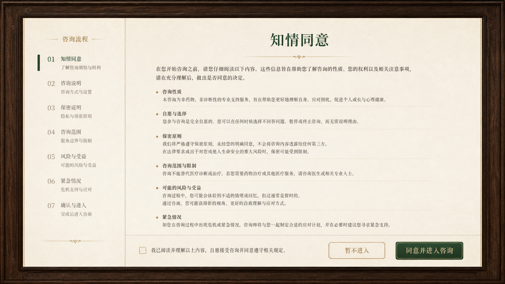

# 首次知情同意阅读器

## 已采用方向

首次预约不再使用独立的小型纸卡。它以资料桌阅读页为视觉与信息真值：统一的胡桃木外框、暖纸内页、居中标题、右上工作室署名、左侧章节目录和右侧可滚动正文。

方向稿仅用于确认布局和操作层级；正式页面继续使用已有木框切片、纸张素材、字体和 React 组件，不使用整页图片。

## 交互

- 内容与资料桌的 `informed-consent.md` 共用，首次进入时直接呈现其导读及七个章节。
- 左侧目录切换章节；正文独立滚动，确保长文可读。
- 底部固定在右侧纸面中：未默认勾选的同意框、`暂不进入` 和禁用态的 `同意并进入咨询`。
- 勾选后才能提交；关闭和“暂不进入”均退出此次预约流程，不提供返回资料桌的接口。
- 窄窗口将页面改为纵向阅读，目录在正文前，操作区保持可达。
