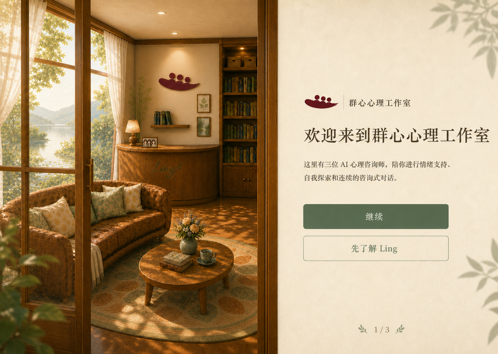
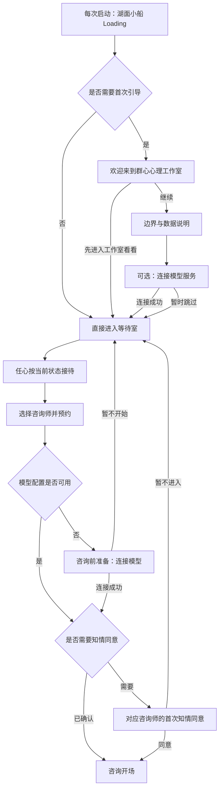

# 启动、首次引导与咨询前模型连接

当前实现状态：湖面 Loading、欢迎页、边界与数据说明、首次 DeepSeek 连接及新老用户启动分流已接入；“首次咨询前补连模型”仍按后续独立任务推进。

## 目标

Ling 上线版需要把“打开 App”变成一次自然抵达，同时让首次使用者理解产品边界、数据去向和模型连接方式。流程应满足：

- 每次启动都有安静、有人味的等待反馈；
- 只有新用户看一次完整欢迎引导，老用户不被重复拦截；
- 用户可以先浏览工作室，不必在理解产品前填写 API Key；
- 真正开始咨询前必须具备模型配置，并在知情同意之前补齐；
- 模型连接、知情同意和咨询开场连续发生，不把用户带去独立设置页；
- 失败、取消和跳过都不丢失用户刚才选择的咨询师，也不留下可见的空会谈。

## 已确认的视觉方向

### 1. 湖面小船 Loading

- 全屏湖面晨光，使用群心三人舟 Logo 作为唯一视觉主体。
- 小船做幅度很小的上下漂浮和左右摇摆；水面倒影缓慢呼吸。
- 真实启动状态、角色氛围短句和功能提示分层显示。
- 方向稿只确认构图与气质。正式实现使用独立湖面背景、现有透明 Logo 和 HTML/CSS 动画，不把文字烘焙进整页图片。

### 2. 工作室门廊欢迎页

- 左侧保留等待室内景、窗外湖光和打开的门廊感。
- 右侧使用现有暖纸、胡桃木、植物绿和酒红 Logo 设计语言。
- Loading 完成后先保留湖光，再显现门廊与右侧内容，避免白闪或硬切。
- 后续“边界与数据说明”和“模型连接”沿用同一左右结构，只替换右侧内容。

## 总流程

## 启动判定

### 新用户

首次启动显示：

1. 湖面小船 Loading；
2. 工作室欢迎页；
3. 用户可继续阅读说明并配置模型，也可直接进入等待室浏览。

只要用户从欢迎页进入过等待室，无论是否配置模型，本轮欢迎引导都视为完成。

### 老用户

每次启动只显示湖面小船 Loading，完成后直接进入等待室，不再显示欢迎页。

以下情况也按老用户处理：

- 已存在会谈、来信或有效设置的升级用户；
- 用户曾跳过模型连接；
- 用户后来主动删除 API Key；
- 用户恢复了不包含 API Key 的本地备份。

这些情况只影响模型门禁，不应重新播放欢迎引导。

## Loading 设计

### 动画

- 小船上下位移约 `3–5px`，旋转不超过 `1deg`，完整周期约 `5–6s`。
- Logo 下方水影使用低透明度缩放与淡入淡出，不制造明显波浪特效。
- 页面退出使用 `400–650ms` 淡出；欢迎页内景在湖光仍可见时开始显现。
- 开启“减少动态”时，取消漂浮、摇摆和位移，只保留短淡入淡出。

### 信息层级

第一层始终显示真实状态，示例：

- `正在打开 Ling……`
- `正在读取本机设置……`
- `正在整理上次停留的位置……`

第二层每 `3–4s` 淡入切换氛围短句：

- `程灵沿着湖边慢慢走一圈。`
- `周舟把刚读完的书放回书架。`
- `林乐水正在整理今天的咨询室。`
- `任心给大厅添了一壶热水。`
- `工作室的灯已经亮起来了。`

第三层只在启动超过约 `2.5s` 时出现功能提示：

- `会谈和设置默认保存在这台设备上。`
- `书架里可以了解三位咨询师的工作方式。`
- `沙发边收着咨询师在会谈后写给你的信。`
- `资料桌里有使用说明、知情说明与危机支持信息。`

不为了展示所有文案故意延长启动；建议最短可见时间约 `700ms`，加载完成后即可转场。

## 首次引导页面

### 第 1 页：欢迎

标题：

> 欢迎来到群心心理工作室

正文：

> 这里有三位 AI 心理咨询师，陪你进行情绪支持、自我探索和连续的咨询式对话。

操作：

- `继续`：进入“边界与数据说明”。
- `先进入工作室看看`：将欢迎引导标记为完成，直接进入等待室。

不使用含义模糊的“先了解 Ling”；次按钮必须清楚表达“跳过当前准备、进入可浏览状态”。

### 第 2 页：边界与数据说明

沿用左侧工作室内景和右侧暖纸，不使用勾选框，也不把这一页称为知情同意。

#### Ling 能做什么

> 提供 AI 情绪支持和自我探索，但不能替代专业心理咨询、精神科诊疗或危机帮助。

#### 资料保存在这里

> 会谈、来信和设置默认保存在这台设备上。Ling 不提供云同步，也不会把它们另行上传。

#### 生成回应时

> 当前会谈中必要的内容会通过你的 API Key 发给你选择的模型服务（如 DeepSeek），用来生成回复；Ling 不会再发往其他地方。

另以一行较弱说明补充：模型服务如何处理这次请求，以服务商的规则为准。

操作：

- `我知道了，继续`：进入模型连接页。
- `返回`：回到欢迎页。

### 第 3 页：连接 DeepSeek

标题：

> 连接 DeepSeek

说明：

> 有了自己的 API Key，Ling 才能生成咨询回应。服务地址和推荐模型已经替你设置好。

默认只显示：

- DeepSeek 官方 API Keys 页面入口和一句获取说明；
- DeepSeek API Key 输入框；
- 显示或隐藏密钥；
- `连接并继续`；
- `暂时跳过`。

首次引导不显示 Base URL、模型名称或后台模型分配。保存时自动使用 DeepSeek 官方地址与 DeepSeek V4 Flash 推荐配置；高级设置继续留在“设置 → 模型接入”。

#### 连接成功

- 自动保存并测试连接；
- 测试成功后直接进入等待室，由任心开始首次接待；
- 失败时留在当前页显示原因，并保留输入。

#### 暂时跳过

- 将欢迎引导标记为完成；
- 直接进入等待室；
- 不在浏览书架、资料桌、花园、来信或咨询师介绍时反复催促；
- 只有真正预约咨询时才触发模型门禁。

## 咨询前模型连接

当用户选择咨询师并预约，而本机没有可用模型配置时，在知情同意之前显示模型连接。

### 视觉与位置

- 复用首次知情同意的胡桃木外框、暖纸内页、背景虚化和阅读宽度。
- 不跳转到系统设置，不暴露完整模型分流表单。
- 标题带入当前咨询师，例如：`与程灵开始咨询前 · 模型连接`。
- 用户连接成功后，在同一个场景和容器内切换到知情同意，避免返回等待室再预约一次。

### 内容

标题：

> 为 Ling 连接模型服务

说明：

> Ling 需要连接模型服务，才能生成咨询回应。API Key 会保存在这台设备上；咨询所需的内容将发送到你配置的模型服务。

操作：

- `连接并继续`：保存并测试；成功后进入下一项咨询前准备。
- `暂不开始`：取消本次进入，回到等待室并保留刚才选择的咨询师上下文。
- `更多设置`：展开 Base URL 和模型名称。

### 成功后的路由

- 若该用户尚未确认这位咨询师的当前版知情说明：进入知情同意。
- 若已经确认：直接进入咨询开场。
- 不固定显示“第 1/2 步”；步骤数量应根据当前缺少的准备项动态决定。

### 失败与取消

- 失败时停留在模型页，保留用户输入，不泄露完整 API Key。
- 错误说明具体到服务地址、模型名、API Key 或账户状态，不使用笼统的“未知错误”。
- 取消、关闭或连接失败不得留下用户可见的空会谈。
- 再次预约时仍定位到此前选择的咨询师，但不自动提交预约。

## 返回等待室后的接待

欢迎页不承担老用户的“继续咨询”入口。所有返回状态由等待室中的任心承接。

### 有尚未结束的咨询

> 欢迎回来。你和程灵上次的咨询还在继续，需要现在回到咨询室吗？

- `继续上次咨询`
- `先在工作室看看`

### 没有进行中的咨询，但有历史记录

> 欢迎回来。今天想继续和熟悉的咨询师谈谈，还是先在这里坐一会儿？

- `预约咨询`
- `先在工作室看看`
- 有可读来信时显示 `查看咨询师的信`

### 第一次进入等待室

沿用现有首次接待：

- `预约咨询`
- `介绍一下工作室`
- `我先随便看看`

## 状态模型

启动与咨询准备至少分别判断以下状态：

| 状态 | 用途 |
| --- | --- |
| `launchOnboardingVersion` | 判断是否需要显示当前版本欢迎引导 |
| `apiKeySaved` 与必要模型字段 | 判断开始咨询前是否需要模型连接 |
| 对应咨询师的知情说明版本 | 判断是否需要显示知情同意 |
| 未结束会谈与最近咨询师 | 决定任心的返回接待选项 |

设计规则：

- 欢迎引导、模型配置和知情同意是三个独立状态，不互相代替。
- 删除 API Key 只改变模型状态。
- 知情说明发生重要版本变化时，只重新确认知情说明。
- 升级用户应通过 migration 或既有数据判定跳过欢迎引导，避免更新后被误认成新用户。

## 无障碍与窗口适配

- Loading 的真实状态使用 `aria-live="polite"`；氛围短句不重复打断读屏。
- 右侧内容按标题、正文、表单、操作的顺序进入焦点。
- 密钥输入支持粘贴、显示/隐藏和清晰的错误关联。
- 窄窗口下改为上下结构：内景缩短为顶部氛围区，右侧纸面成为主要可滚动区域。
- 主操作始终可达，不因正文滚动或系统缩放被裁切。
- “减少动态”下取消位移动画并缩短转场。

## 验收标准

1. 新安装首次启动：Loading → 欢迎 → 说明 → 可连接或跳过 → 等待室。
2. 首次引导跳过模型：可以浏览工作室；预约时先连接模型，再进入知情同意。
3. 已配置模型的新用户：预约时直接进入知情同意。
4. 已确认知情说明但后来删除 API Key：预约时只连接模型，成功后直接进入咨询开场。
5. 老用户正常启动：Loading 后直接进入等待室，不再显示欢迎页。
6. 升级用户、恢复备份用户和删除密钥用户不会被误判为首次使用。
7. 模型连接取消或失败不会留下可见空会谈，也不会丢失刚才选择的咨询师。
8. 减少动态、键盘操作、读屏和窄窗口下均可完成全部流程。
