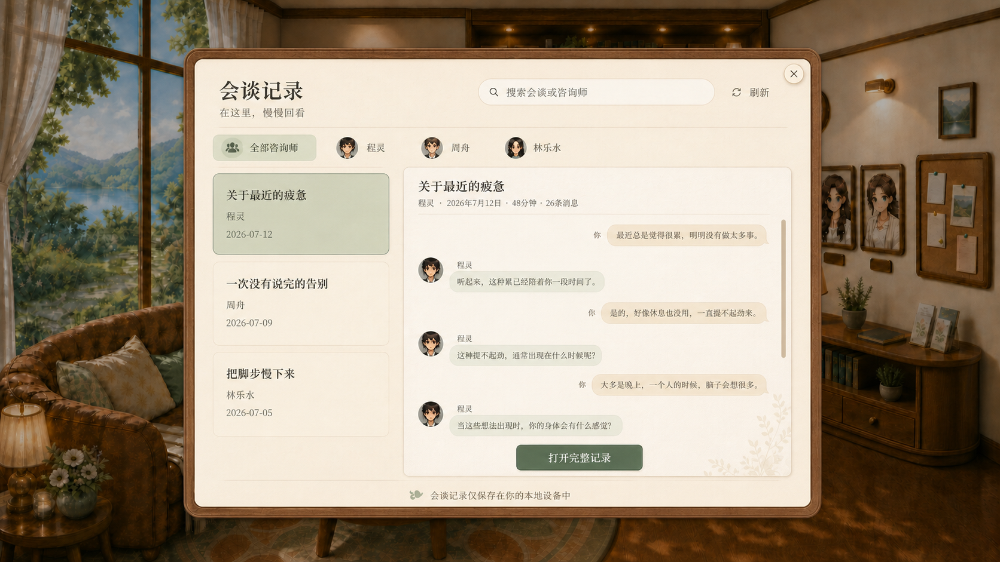

# 沙发会谈记录设计方向

状态：方向稿待确认  
分支：`feat/lobby-consultation-history`

## 背景

等待室底部导航已经提供“咨询师的信”入口，因此沙发区不再重复承载读信。沙发改为“会谈记录”入口，用来安静回看用户与不同咨询师进行过的历史会谈。

## 推荐方向

沿用原沙发来信页的空间和容器，不重新设计一套视觉系统：

- 保留等待室背景、胡桃木外框、暖纸内页、关闭按钮、咨询师头像筛选、搜索和本地保存说明；
- 标题改为“会谈记录”，副标题为“在这里，慢慢回看”；
- 左侧约 34% 显示会谈列表，按结束时间从新到旧排列；
- 右侧约 66% 显示选中会谈的只读预览；
- 顶部只显示咨询师、日期、时长和消息数等客观元信息；
- 正文使用克制的双向对话气泡：用户在右、咨询师在左，咨询师头像仅在必要位置出现；
- 双击会谈卡片或点击预览底部“打开完整记录”均进入完整只读记录；阅读器沿用等待室其他档案的胡桃木切片底框与暖纸内页，关闭后回到原来的筛选、滚动和选中位置。

方向稿只用于确认信息层级、阅读方式和整体氛围。正式实现应复用项目现有 React、CSS、头像素材、木框与消息数据，不把效果图作为整页图片接入。

## 为什么选择对话气泡

### 推荐：轻量元信息 + 原始对话气泡

这是最接近用户当时体验、也最少二次解释的一种形式。气泡比整页逐字稿更容易辨认双方说话顺序，又不会把会谈加工成带结论的报告。

### 不作为主界面：长篇连续文本

连续文本适合导出或打印，但在桌面端回看时难以快速定位是谁说了什么，也与现有咨询室消息流差异过大。

### 暂不加入：AI 摘要、情绪曲线和主题标签

这些内容可能把“回看原始记录”变成对用户的再次分析，并带来误读、隐私暴露和生成状态处理。若未来需要，可将用户主动生成的会谈总结作为独立入口，不与原始记录混在一起。

## 信息结构

### 咨询师筛选

- 所有记录（记录本图标）；
- 程灵；
- 周舟；
- 林乐水。

切换咨询师后，左侧列表与右侧选中项一起更新。第一版搜索范围包含会谈标题和咨询师姓名，不生成搜索历史，也不为搜索预加载所有私密消息正文。

### 会谈列表

每项显示：

- 会谈标题；
- 咨询师姓名；
- 结束日期；
- 可选的消息数，不显示内容敏感的自动标签。

会谈名称直接使用用户原本在会谈列表中保存的名称，不自动重写。每张卡片右下角的“…”菜单提供“重命名”和“删除”：重命名立即写回本地会谈记录；删除必须二次确认，且仅允许删除已经结束的会谈。删除确认使用 App 内的暖纸确认面板，不调用系统原生确认窗。

草稿会谈不进入档案。进行中的会谈可以暂不显示，第一版优先收纳已结束会谈，避免用户误以为可从沙发继续输入。

### 会谈预览

- 标题和客观元信息固定在顶部；
- 中间区域独立滚动；
- 用户消息使用暖米色气泡并靠右；
- 咨询师消息使用浅灰绿色气泡并靠左；
- 双方的名字都置于气泡上方，头像分别置于各自外侧；用户头像优先使用个人资料头像，未设置时显示“我”；
- 附件显示为只读附件卡片；
- 失败、取消或仍在流式生成的临时消息不伪装成已完成内容；
- 双击列表卡片或点击预览底部“打开完整记录”进入独立的完整阅读页。

### 完整阅读页

- 作为覆盖在档案页上的近全屏阅读器出现，使用与读信/资料桌相同的胡桃木外框与纸张底纹；纸张内侧不再添加额外圆角框线；
- 顶部固定显示会谈名称、咨询师、日期、时长、消息数；“返回会谈列表”与标题同一横向布局，不贴边；
- 全部原始对话置于居中的窄阅读列内独立滚动，保留两侧留白；用户靠右、咨询师靠左，保留双方头像与姓名；
- 关闭阅读器后仍保留列表筛选、搜索与选中状态。

## 状态与边界

- 加载：显示“正在读取本机会谈记录……”；
- 空状态：说明完成一次会谈后可在这里回看；
- 搜索无结果：保留筛选，并提供清空搜索；
- 单场消息加载失败：列表仍可使用，右侧允许重新读取；
- 整体读取失败：显示错误和重新读取；
- 所有记录默认仅保存在本机；若未来加入摘要生成，必须单独说明会发送到用户配置的模型服务。

## 响应式

- 宽屏保持左右双栏；
- `1024×720` 缩小列表宽度、气泡最大宽度和内边距，但不缩小到难以阅读；
- 更窄窗口切换为“会谈列表 → 单场预览”的单栏流程；
- 返回列表时保留筛选、搜索、滚动和选中状态。

## 可复用范围

- 复用 `LobbyFeatureFrame` 的统一木框与暖纸容器；
- 复用原来信档案的咨询师筛选、搜索、列表/预览响应式结构和空/错状态；
- 复用现有咨询师对话头像；
- 复用 `sessions.list`、`messages.listBySessionId` 和本地 session store；
- 复用咨询室现有消息内容解析，但为档案页提供更紧凑的只读样式；
- 底部导航的“咨询师的信”继续打开现有 `SofaLettersFeature`，沙发热点改为新的会谈记录 feature。

## 第一版验收

1. 沙发热点显示“会谈记录”，不再打开来信档案。
2. 底部导航“咨询师的信”功能保持不变。
3. 用户可以切换咨询师、搜索和选择已结束会谈。
4. 右侧可以预览真实消息并打开完整只读记录。
5. 窄窗口可以在列表和预览之间返回，不丢失上下文。
6. 不新增诊断、评分、情绪曲线、未读提醒或游戏化元素。
